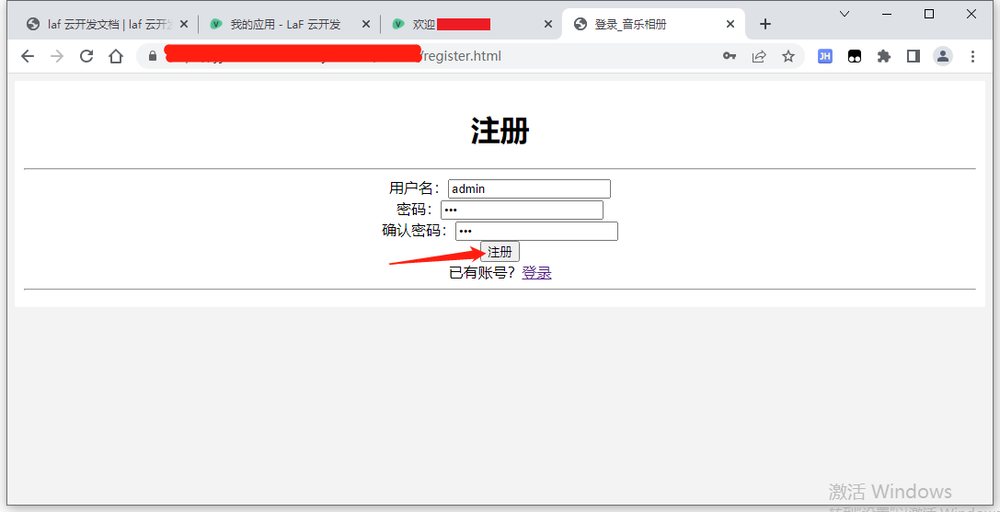

# 如何注册管理员账号？

1. 先在注册页面，注册一个普通账号。

2. 登录LaF云开发后台，打开相册对应的应用，依次打开 `云数据库` => `集合管理`。

3. 点击`album_users`，在右侧依次查看`username`后的值，直到找到刚才与刚才注册用户的用户名名相同的一项，点击编辑。

4. 在右侧弹出的窗口里找到`is_admin`字段

5. 将`is_admin`字段后面的单词改成`true`（不要拼错！），然后点击保存。
  + 如果想取消该用户管理员权限，则将`is_admin`字段后面的单词改成`false`

6. 看到`更新成功`代就成功了！

7. 现在再用刚才注册的账号登录后台即可登录成功。
